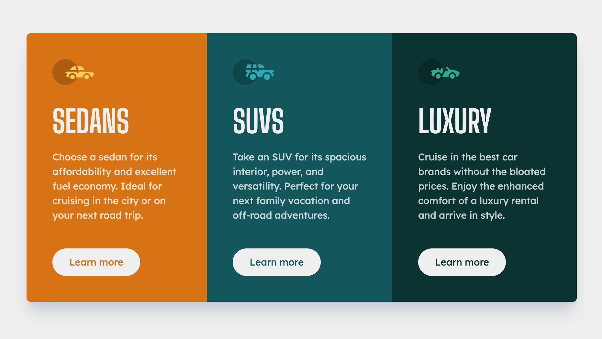

# Frontend Mentor - 3-column preview card component

## Welcome! 👋

This is a solution to the [3-column preview card component challenge on Frontend Mentor](https://www.frontendmentor.io/challenges/3column-preview-card-component-pH92eAR2-). Frontend Mentor challenges help you improve your coding skills by building realistic projects.

## Table of contents

- [Overview](#overview)
  - [The challenge](#the-challenge)
  - [Screenshot](#screenshot)
  - [Links](#links)
- [My process](#my-process)
  - [Built with](#built-with)
- [Author](#author)

## Overview

### The challenge

Users should be able to:

- View the optimal layout depending on their device's screen size
- See hover states for interactive elements

### Screenshot

Here's my screenshot of the done project.

### Links

- Solution URL: [Check the solution here](https://www.frontendmentor.io/solutions/3column-preview-card-component-0onEf-9n5S)
- Live Site URL: [Check live site here](https://m-rokon.github.io/3-col-preview-card/)

## My process

### Built with

- Semantic HTML5 markup
- TailwindCSS
- Flexbox
- Mobile-first workflow

## Author

- Website - [rokon.dev](https://www.rokon.dev)
- Frontend Mentor - [@m-rokon](https://www.frontendmentor.io/profile/m-rokon)
- Twitter - [@mrokon30](https://www.twitter.com/mrokon30)

